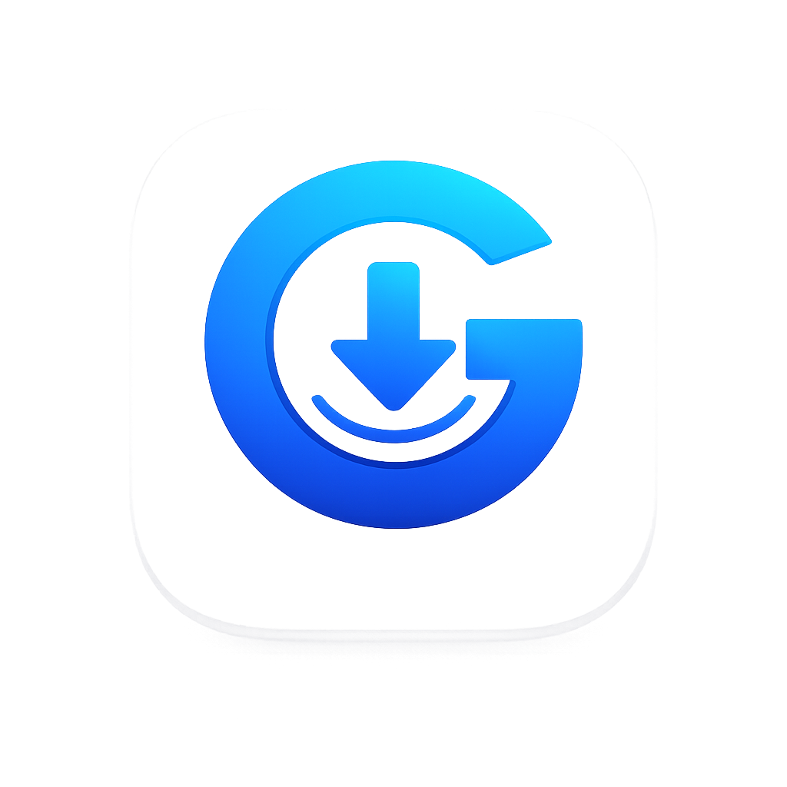

<div align="center">



# Gograb

**A fast, lightweight YouTube video & audio downloader for Windows**

Built with WPF + .NET 8 — no runtime install, no manual setup, just download.


[Download](#-download) • [Features](#-features) • [How It Works](#-how-it-works) • [Build from Source](#-build-from-source) • [Contributing](#-contributing)

</div>

---

## 📸 Preview

<div align="center">
  
</div>

---

## ✨ Features

| | |
|---|---|
| 🎬 **Multiple Resolutions** | Download video in 1080p, 720p, 480p, or 320p |
| 🎵 **Audio Extraction** | Save any video as a clean MP3 |
| 📱 **For Mobile Mode** | Auto-converts to 128×160 for older/mobile devices |
| 🌓 **Dark Mode** | Native light & dark themes |
| 📋 **Clipboard Auto-Detect** | Copy a YouTube link and it appears instantly |
| 📦 **Batch Downloads** | Queue multiple videos and download them all at once |
| 🔍 **Status Filters** | Filter queue by All, Ready, Processing, Failed, Skipped, Complete |
| ⏹️ **Cancel Anytime** | Stop any download mid-progress, no leftover junk |
| ⚙️ **Zero Setup** | yt-dlp and ffmpeg are bundled in — nothing to install separately |
| 🚀 **Self-Contained** | Runs without a .NET runtime installation |

---

## 📥 Download

### Option 1 — Installer (Recommended)

Grab the latest installer from the [**Releases**](../../releases/latest) page:

```
Gograb-v1.0.0-Setup.exe
```

Everything is bundled — yt-dlp, ffmpeg, and the .NET runtime. Just install and go.

### Option 2 — Build from Source

```bash
git clone https://github.com/yourusername/Gograb.git
cd Gograb
dotnet build
```

---

## 🖥️ Requirements

**None.** The installer ships with everything needed:

- ✅ .NET 8 Runtime — bundled
- ✅ yt-dlp — bundled
- ✅ ffmpeg — bundled
- ✅ Node.js — optional, only used automatically for certain YouTube JS challenges

---

## 🚀 How It Works

1. **Paste a YouTube link** — or let it auto-detect from your clipboard
2. **Choose a resolution** — 1080p / 720p / 480p / 320p, or audio-only MP3
3. **Toggle "For Mobile"** — converts output to 128×160 for mobile playback
4. **Hit Download** — live progress shown as a percentage
5. **Click again to cancel** — stops the download cleanly at any time

---

## 🗂️ Project Structure

```
Gograb/
├── App.xaml / App.xaml.cs          # Application entry, global error handler
├── MainWindow.xaml / .cs           # Main UI — 420px compact layout
├── DarkTheme.xaml                  # Dark mode colors & control styles
├── LightTheme.xaml                 # Light mode colors & control styles
├── AssemblyInfo.cs                 # Theme info
│
├── Views/
│   ├── AboutWindow.xaml / .cs      # Slim about dialog
│   └── SettingsWindow.xaml / .cs   # Settings (removed in current version)
│
├── ViewModels/
│   └── MainViewModel.cs            # MVVM logic, queue management
│
├── Models/
│   ├── DownloadItem.cs             # Download item properties
│   └── AppSettings.cs              # Settings model
│
├── Services/
│   ├── YtDlpService.cs             # yt-dlp & ffmpeg integration
│   └── SettingsManager.cs          # JSON settings persistence
│
├── Converters/
│   ├── InverseBooleanConverter.cs
│   └── CountToVisibilityConverter.cs
│
├── logo.ico / logo.png             # App icon & logo source
├── Gograb.csproj                   # Project file
├── setup.iss                       # Inno Setup installer script
└── installer/
    └── Gograb-v1.0.0-Setup.exe     # Pre-built installer
```

---

## 🧱 Tech Stack

| Component | Technology |
|---|---|
| UI Framework | WPF (.NET 8) |
| MVVM | CommunityToolkit.Mvvm |
| Video Downloader | yt-dlp (nightly) |
| Video Converter | ffmpeg |
| Installer | Inno Setup 6 |

---

## 🛠️ Building the Installer

```bash
# 1. Publish self-contained
dotnet publish -c Release --self-contained -r win-x64 -o publish

# 2. Copy yt-dlp.exe and ffmpeg into the publish folder

# 3. Compile the installer (requires Inno Setup 6)
"C:\Program Files (x86)\Inno Setup 6\ISCC.exe" setup.iss
```

---

## 🤝 Contributing

Contributions, bug reports, and feature requests are welcome!

1. Fork the repository
2. Create a feature branch (`git checkout -b feature/amazing-feature`)
3. Commit your changes (`git commit -m 'Add amazing feature'`)
4. Push to the branch (`git push origin feature/amazing-feature`)
5. Open a Pull Request

---

## 📄 License

Released under the **MIT License** — see [LICENSE](LICENSE) for details.

---

## 🙏 Acknowledgments

- [yt-dlp](https://github.com/yt-dlp/yt-dlp) — YouTube download engine
- [FFmpeg](https://ffmpeg.org/) — Media conversion
- [Inno Setup](https://jrsoftware.org/isinfo.php) — Installer builder
- [CommunityToolkit.Mvvm](https://learn.microsoft.com/en-us/dotnet/communitytoolkit/mvvm/) — MVVM toolkit

<div align="center">

Made with ❤️ for simple, ad-free YouTube downloads.

</div>
